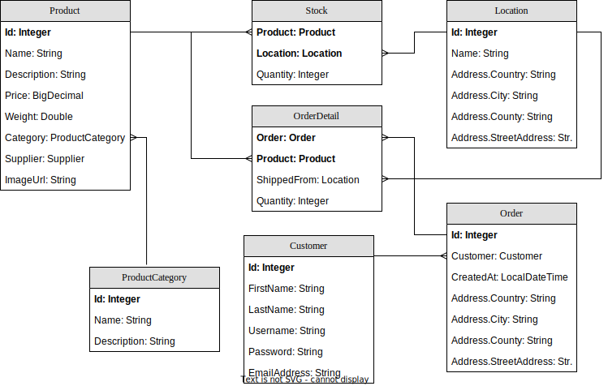

# Spring Training: Resources

## Contents

 - [Working Mode](#working-mode)
 - [Environment](#environment)
 - [Online Shop](#online-shop)
 - [Chapters](#chapters)
   * [1. Java, Git, Maven](https://github.com/msg-CareerPaths/spring-training/blob/career-start-2023/chapters/100-java-maven.md)
   * [2. Spring Basics](https://github.com/msg-CareerPaths/spring-training/blob/career-start-2023/chapters/200-spring-basics.md)
   * [3. Spring Boot](https://github.com/msg-CareerPaths/spring-training/blob/career-start-2023/chapters/300-spring-boot.md)
   * [4. JPA and Flyway](https://github.com/msg-CareerPaths/spring-training/blob/career-start-2023/chapters/400-jpa-and-flyway.md)
   * [5. JSON REST APIs](https://github.com/msg-CareerPaths/spring-training/blob/career-start-2023/chapters/500-json-rest-apis.md)
   * [6. Strategy Design Pattern](https://github.com/msg-CareerPaths/spring-training/blob/career-start-2023/chapters/600-strategy-design-pattern.md)
   * [7. Testing](https://github.com/msg-CareerPaths/spring-training/blob/career-start-2023/chapters/800-testing.md)
   * [8. Security](https://github.com/msg-CareerPaths/spring-training/blob/career-start-2023/chapters/opt-300-oauth.md)
   * [OPT-1. State Machine](https://github.com/msg-CareerPaths/spring-training/blob/career-start-2023/chapters/900-state-machine.md)
   * [OPT-2. Java Mail](https://github.com/msg-CareerPaths/spring-training/blob/career-start-2023/chapters/opt-700-java-mail.md)
   * [OPT-3. WebSocket](https://github.com/msg-CareerPaths/spring-training/blob/career-start-2023/chapters/opt-800-websocket.md)

## Working Mode

The road-map consists of several steps. In each step, a set of theoretical concepts are explored, supported by reference documentation, book chapters, tutorials and videos. In parallel, a simple application will be built with the learned concepts: the *Online Shop* application.

After the learning material for a given step was sufficiently explored, either some new functionality will be added to this application or old functionality will be refactored.

Developers are expected to perform developer tests with Postman once the REST APIs are implemented. The application will have a user interface, once the Spring training is completed.

All the code written must be published on GitHub. Commits must be pushed when each individual chapter is finished. In order to request a code review from the trainers, you must [open a pull request](https://help.github.com/en/articles/creating-a-pull-request) from the `develop` to the `master` branch.

For doing static code quality checks, two separate mechanisms will be used:
 - The plugin for SonarLint and the built-in code analysis must be used to fix code issues.
 - [Codacy](https://www.codacy.com/) will be enabled and developers should check the detected issues periodically. 

## Environment

You can work using your local environment:
 - You need to install [Postman](https://www.getpostman.com/apps), [IntelliJ IDEA (Community)](https://www.jetbrains.com/idea/download/#section=windows), SonarLint and Lombok [plugins for IntelliJ](https://www.jetbrains.com/help/idea/managing-plugins.html#install_plugin_from_repo). Note: the newer versions of Intellij already have the Lombok installed. Please check it before trying to install it.
 - You will also need [PostgreSQL](https://www.enterprisedb.com/downloads/postgres-postgresql-downloads).
 - Install also [pgAdmin](https://www.sqlshack.com/an-overview-of-pgadmin-postgresql-management-tool/) on your computer which will provide you a way to query and manage your database.

## Online Shop
The application will deal with the management and daily functioning of a small online shop. Business processes:
 - **Order creation**: an end customer places an order to buy several products (based on the availability of the products in the stock).
 - **Stock management**: the existing product stocks are updated automatically based on the orders placed by customers.

Throughout the application, we assume that prices are always in EUR and weights are always in KG. 

